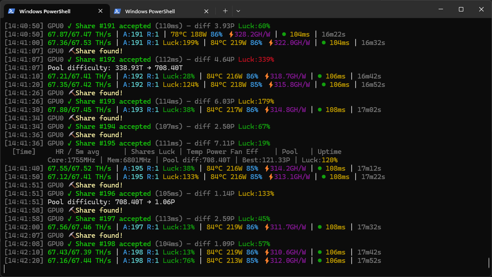

# Ryvex - GPU Miner

Ryvex is a multi-algorithm NVIDIA CUDA GPU miner for Ravencoin, Ergo, IronFish,
Zano, FiroPoW coins (1% dev fee; FIRO exact-RC validation remains pending), and Pearl.
Ryvex v1.17.1 is the current release candidate. The latest public release
is v1.17.0; download it from the [v1.17.0 GitHub release](https://github.com/ryvexminer/ryvex/releases/tag/v1.17.0).

> **v1.17 validation status:** historical v1.17 pool H2H records include parity
> and winner results at their recorded commits.
> A strict offline campaign on two Ada SM89 GPUs measured all six active
> algorithms for 150 seconds with positive rates on both GPUs. This demonstrates
> execution on that test setup only;
> live pool/solo behavior, competitive parity, profitability, and other GPU
> architectures remain separate release checks.

## Ryvex in action



Pearl / NoisyGEMM live CLI session with accepted shares on an RTX 3070 with +165 MHz core OC. Actual hashrate, power, thermals, latency, and share timing vary by GPU, tuning, pool, and network difficulty.


Ravencoin / KawPoW live CLI session on an RTX 3070 with 60% power limit and +900 MHz memory OC.


## Release focus in v1.17

- **Local control plane** - authenticated pause, resume, GPU restart, configured
  pool selection, Profit Autopilot mode, and a safe audit timeline through the
  CLI, HTTP API, and integrated WebUI.
- **Conservative automation** - Profit Autopilot defaults to `dry_run`; it
  fails closed when prices, hashrate, power, health, or candidates are unsafe.
- **Private-by-design fleet view** - optional multi-rig summaries are read-only
  and fetched server-side, so browsers never receive remote credentials.
- **Validation boundary** - CLI, Core, Config, and integrated WebUI checks are
  release gates. Exact KawPoW GPU/CPU checks, revision A/B/A, and short
  two-device scaling are recorded on SM86, SM89, and SM120. The generated
  KawPoW runtime remains opt-in. These results do not establish competitive
  parity, live pool/solo stability, or prolonged restart stability; those
  remain separate publication gates.
- **Desktop GUI paused** - the Tauri/Svelte desktop application is not part of
  the v1.17 release gate.

## Supported algorithms

| Coin | Setup value | Algorithm | Current v1.17 status |
|------|-------------|-----------|--------|
| Ravencoin | `RVN` | `kawpow` | CUDA route; historical SM120 1-GPU pool H2H record; strict offline Ada 2-GPU execution measured; live/competitive validation pending |
| Ergo | `ERG` | `autolykos2` | CUDA route; historical SM120 1-GPU pool H2H record; strict offline Ada 2-GPU execution measured; live/competitive validation pending |
| IronFish | `IRON` | `fishhash` | CUDA route; historical SM120 1-GPU pool H2H record; strict offline Ada 2-GPU execution measured; live/competitive validation pending |
| Zano | `ZANO` | `progpowz` | CUDA route; historical SM86 1-GPU pool H2H record; strict offline Ada 2-GPU execution measured; live/competitive validation pending |
| Firo | `FIRO` | `firopow` | CUDA route, requires ≥ 10 GB VRAM; historical SM89 2-GPU pool H2H record; strict offline Ada 2-GPU execution measured; live/competitive validation pending |
| Kiirocoin | `KIIRO` | `firopow` | CUDA route; historical accepted-share evidence exists, current RC validation pending |
| Pearl | `PRL` | `pearl` / `noisygemm` | CUDA route (ws_gemm SM86); historical accepted-share evidence exists, strict offline Ada 2-GPU execution measured; live/competitive validation pending |

Production mining algorithms use a 1% dev fee on every public route.

## Quick start

### 1. Extract the release

Extract the Windows `.zip` or Linux `.tar.gz` into a folder you can write to.

### 2. Run directly from CLI flags

If you already know your algorithm, pool, and wallet, Ryvex can start without
a `config.toml`.

Windows:

```powershell
.\ryvex.exe --algo pearl --pool stratum+tcp://pearl-eu1.luckypool.io:3360 --wallet YOUR_PRL_WALLET.rig1
```

Linux:

```bash
./ryvex --algo pearl --pool stratum+tcp://pearl-eu1.luckypool.io:3360 --wallet YOUR_PRL_WALLET.rig1
```

Nothing is written to disk in this mode. Use `--first-run-setup` when you want
Ryvex to create a persistent configuration and launchers.

### 3. Run setup

Windows:

```powershell
.\ryvex.exe --first-run-setup --setup-coin RVN --setup-wallet YOUR_RVN_WALLET --setup-worker my-rig
```

Linux:

```bash
./ryvex --first-run-setup --setup-coin RVN --setup-wallet YOUR_RVN_WALLET --setup-worker my-rig
```

Use `--setup-coin ERG`, `--setup-coin IRON`, `--setup-coin ZANO`, `--setup-coin FIRO`, `--setup-coin KIIRO`, or `--setup-coin PRL` for the other coins. FiroPoW coin profiles are separated by coin so FIRO and KIIRO use their own pool and dev-fee routes. Setup writes `config.toml` and generated launch files for the selected coin. The setup output prints the exact paths.

### 4. Check the install before mining

Windows:

```powershell
.\ryvex.exe --preflight --config config.toml
```

Linux:

```bash
./ryvex --preflight --config config.toml
```

Preflight mode does not mine or submit shares. It validates the local setup, checks pool transport endpoints, then probes Stratum subscribe, authorization, and first-job parsing when transport is reachable.

### 5. Start Ryvex

Use the generated `.bat` file on Windows or `.sh` file on Linux. You can also start manually:

Windows:

```powershell
.\ryvex.exe --config config.toml
```

Linux:

```bash
./ryvex --config config.toml
```

## Manual config

Setup is the recommended path for a new install. If you prefer to edit `config.toml` yourself, use explicit Stratum prefixes:

```toml
worker_name = "my-rig"
algorithm = "kawpow"

[[pools]]
url = "stratum+ssl://pool.example.com:1234"
wallet = "YOUR_WALLET"
tls = true
```

Use `stratum+ssl://` for TLS endpoints and `stratum+tcp://` for plaintext endpoints.

## Preflight Diagnostics

`--preflight` is intended for first-run checks and support triage. It verifies:

- config parsing and required fields;
- selected algorithm and coin mapping;
- GPU discovery without launching mining kernels;
- pool endpoint URL shape, including explicit `stratum+tcp://` or `stratum+ssl://`, host, port, and no embedded wallet or query string;
- DNS resolution and TCP reachability for configured pool endpoints;
- TLS negotiation and certificate validation for TLS endpoints;
- Stratum protocol readiness after transport passes: subscribe confirmation, authorization response, and a parseable first job.

Plaintext TCP endpoints show TLS and certificate checks as not run. Protocol checks are skipped when URL, DNS, TCP, TLS, or certificate failures block transport.

Fix any reported issue, then run `--preflight` again before starting the miner. See [Troubleshooting](docs/troubleshooting.md) for first-run fixes and [Pool Compatibility Evidence](docs/pool-compatibility.md) for historical endpoint evidence. It does not establish current v1.17 RC validation.

## Support report

If you need a support report, generate a redacted JSON file:

```powershell
.\ryvex.exe --support-report --support-report-output ryvex-support-report.json
```

The same report can be exported from the local dashboard at `http://localhost:8081`. The older `--diagnostics --diagnostics-output` command remains available as a compatibility alias.

Support reports include version, OS, GPU, driver, redacted config, config warnings, a privacy summary, and recent redacted logs. They do not include raw wallets, pool passwords, dashboard keys, API tokens, webhook URLs, or DAG/cache files.

## Web dashboard

Ryvex starts a local dashboard by default:

```text
http://localhost:8081
```

The dashboard shows device status, shares, pool status, session estimates, and recent events. To disable it, start Ryvex with `--dashboard-port 0`.

For remote access, set `bind_address = "0.0.0.0"` in the `[dashboard]` config section and protect the HTTP API with its configured token.

## Local control client

When a Ryvex miner is already running on the same machine, `ryvex control`
queries or requests a change through its authenticated local API. It never
starts a mining session. The client reads the user-private API token created by
the running miner and writes one versioned JSON document to standard output.

```text
ryvex control status
ryvex control timeline
ryvex control pause
ryvex control resume
ryvex control restart --gpu 0
ryvex control restart
ryvex control switch-pool --pool 1
ryvex control profit-mode --mode dry_run
```

Use `--api-port <PORT>` when the running miner uses a non-default local API
port. Exit status is stable for scripts: `0` accepted or unchanged, `2` invalid
arguments, `3` authentication, `4` unavailable local API, `5` safety or state
rejection, and `1` unexpected failure. API credentials are never printed.
Add `--json` to receive the same JSON error format for invalid control
arguments.

## CLI options

```text
ryvex [OPTIONS]

  -c, --config <CONFIG>       Config file [default: config.toml]
      --first-run-setup       Create config and launchers, then exit
      --setup-coin <COIN>     Coin for setup: RVN, ERG, IRON, ZANO, FIRO, KIIRO, or PRL
      --setup-wallet <WALLET>
                              Wallet address for setup
      --setup-pool <POOL>     Pool preset or full Stratum URL for setup
  -o, --pool <POOL>           Pool URL override
      --coin <COIN>           Coin symbol override for stats/API
  -p, --pass <PASSWORD>       Pool password [aliases: --password]
  -a, --algo <ALGO>           Mining algorithm: kawpow, autolykos2, fishhash, progpowz, firopow, or pearl
      --setup-worker <WORKER>
                              Worker name for setup
  -d, --devices <DEVICES>     GPUs to use, e.g. "0,2"
      --preflight             Validate setup without mining
      --support-report        Write a redacted support report JSON and exit
      --support-report-output <PATH>
                              Support report path
      --benchmark             Benchmark mode without a pool
      --benchmark-duration <S> Benchmark duration in seconds
      --benchmark-json <PATH> Write a benchmark JSON report
      --autotune              Run KawPoW grid autotune during benchmark mode
      --autotune-profile-create <NAME>
                              Create a KawPoW autotune profile from a benchmark JSON report
      --from-benchmark <PATH> Benchmark JSON report used by --autotune-profile-create
      --autotune-profile-list List saved KawPoW autotune profiles
      --autotune-profile <NAME>
                              Apply a saved KawPoW autotune profile to live mining
      --flush-dag             Delete DAG cache and regenerate
      --cpu                   Enable CPU worker
      --force-cpu             CPU-only mode
      --api-port <PORT>       HTTP API port [default: 8080]
      --no-api                Disable HTTP API
      --dashboard-port <P>    Web dashboard port [default: 8081, 0=off]
      --diagnostics           Compatibility alias for support report export
      --diagnostics-output <PATH>
                              Compatibility output path for --diagnostics
      --config-key <KEY>      Encryption key, or env RYVEX_CONFIG_KEY
      --encrypt-config        Encrypt wallets in config and exit
      --profile <NAME>        Load a mining profile
      --gpu-algo <GPU_ALGO>   Algorithm per GPU, e.g. "0:kawpow,1:progpowz"
  -h, --help                  Print help
  -V, --version               Print version
```

## Antivirus notice

Mining software can be flagged by antivirus heuristics because it uses GPU compute and Stratum networking. Verify Ryvex before running it or creating antivirus exclusions.

Each release includes archive checksums and binary signatures:

- `SHA256SUMS.txt` verifies downloaded archives.
- `ryvex.sig` verifies the extracted binary.
- `ryvex-ed25519-public-key.txt` contains the release public key.
- `verify-release-signature.py` verifies the binary signature.

Verify the archive before extracting it; do not hash the extracted binary for the archive checksum step.

Windows:

```powershell
Get-FileHash .\ryvex-vX.Y.Z-windows-x86_64.zip -Algorithm SHA256
```

Linux:

```bash
sha256sum ryvex-vX.Y.Z-linux-x86_64.tar.gz
```

HiveOS:

```bash
sha256sum ryvex-vX.Y.Z-hiveos.tar.gz
```

Compare the result with the matching archive line in `SHA256SUMS.txt`.

After extraction, verify the binary signature:

Windows:

```powershell
python .\verify-release-signature.py --binary .\ryvex.exe --signature .\ryvex.sig --public-key .\ryvex-ed25519-public-key.txt
```

Linux:

```bash
python3 ./verify-release-signature.py --binary ./ryvex --signature ./ryvex.sig --public-key ./ryvex-ed25519-public-key.txt
```

Expected result:

```text
OK: signature valid
```

Only add antivirus exclusions after checksum and signature verification pass.

Additional documentation is shipped in release archives under `docs/`, including download verification, release trust notes, antivirus guidance, troubleshooting, and pool compatibility evidence.

## Requirements

- NVIDIA GPU with CUDA support.
- NVIDIA driver 525.x or newer.
- Windows 10/11 x64 or Linux x64.

## License

Proprietary. See [LICENSE](LICENSE) for details.
