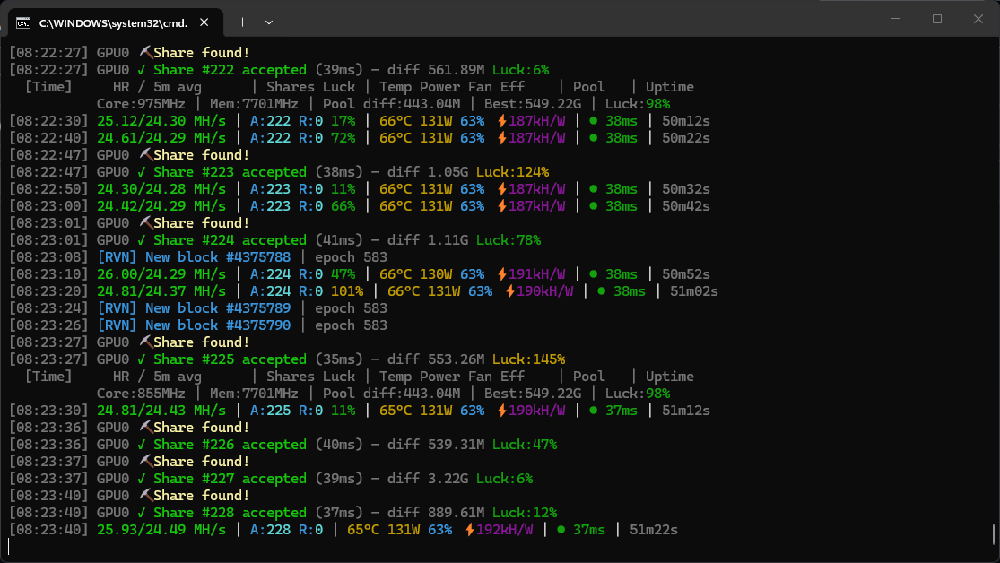
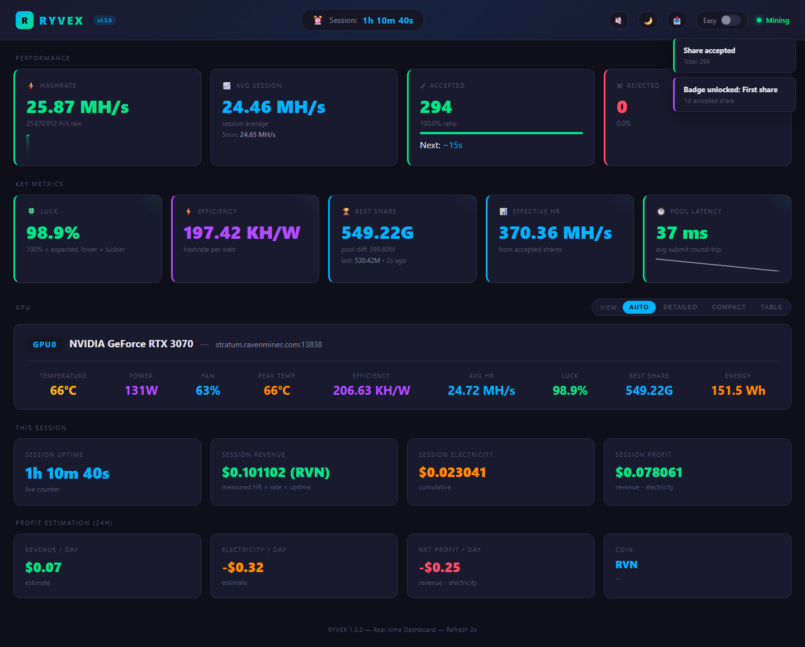

# Ryvex - GPU Miner

Ryvex is a multi-algorithm NVIDIA CUDA miner for Ravencoin, Ergo, and IronFish. v1.7.2 is a HiveOS signature hotfix for v1.7.1.

## Ryvex in action





## What is new in v1.7.2

- **HiveOS signature fix** - the HiveOS archive now signs the exact binary included in the package.
- **One-command setup** - create a usable `config.toml` for RVN, ERG, or IRON from the CLI.
- **Generated launchers** - write matching Windows and Linux launch files for the selected coin and config.
- **Preflight diagnostics** - check config syntax, GPU detection, and pool settings before mining.
- **Support reports** - export a redacted support JSON without raw wallets, pool passwords, API tokens, or webhook URLs.
- **Web dashboard** - local status view at `http://localhost:8081`.
- **Release package fixes** - Linux and HiveOS archives are validated so packaged binaries stay executable.

## Supported algorithms

| Coin | Setup value | Algorithm |
|------|-------------|-----------|
| Ravencoin | `RVN` | `kawpow` |
| Ergo | `ERG` | `autolykos2` |
| IronFish | `IRON` | `fishhash` |

All algorithms use a 1% dev fee.

## Quick start

### 1. Extract the release

Extract the Windows `.zip` or Linux `.tar.gz` into a folder you can write to.

### 2. Run setup

Windows:

```powershell
.\ryvex.exe --first-run-setup --setup-coin RVN --setup-wallet YOUR_RVN_WALLET --setup-worker my-rig
```

Linux:

```bash
./ryvex --first-run-setup --setup-coin RVN --setup-wallet YOUR_RVN_WALLET --setup-worker my-rig
```

Use `--setup-coin ERG` or `--setup-coin IRON` for the other supported coins. Setup writes `config.toml` and generated launch files for the selected coin. The setup output prints the exact paths.

### 3. Check the install before mining

Windows:

```powershell
.\ryvex.exe --preflight --config config.toml
```

Linux:

```bash
./ryvex --preflight --config config.toml
```

Preflight mode does not mine or submit shares. It validates the local setup and reports issues to fix before launch.

### 4. Start Ryvex

Use the generated `.bat` file on Windows or `.sh` file on Linux. You can also start manually:

Windows:

```powershell
.\ryvex.exe --config config.toml
```

Linux:

```bash
./ryvex --config config.toml
```

## Manual config

Setup is the recommended path for a new install. If you prefer to edit `config.toml` yourself, use explicit Stratum prefixes:

```toml
worker_name = "my-rig"
algorithm = "kawpow"

[[pools]]
url = "stratum+ssl://pool.example.com:1234"
wallet = "YOUR_WALLET"
tls = true
```

Use `stratum+ssl://` for TLS endpoints and `stratum+tcp://` for plaintext endpoints.

## Preflight Diagnostics

`--preflight` is intended for first-run checks and support triage. It verifies:

- config parsing and required fields;
- selected algorithm and coin mapping;
- pool URL prefix format;
- GPU discovery;
- pool URL prefix format.

Fix any reported issue, then run `--preflight` again before starting the miner.

## Support report

If you need a support report, generate a redacted JSON file:

```powershell
.\ryvex.exe --support-report --support-report-output ryvex-support-report.json
```

The same report can be exported from the local dashboard at `http://localhost:8081`. The older `--diagnostics --diagnostics-output` command remains available as a compatibility alias.

Support reports include version, OS, GPU, driver, redacted config, config warnings, a privacy summary, and recent redacted logs. They do not include raw wallets, pool passwords, dashboard keys, API tokens, webhook URLs, or DAG/cache files.

## Web dashboard

Ryvex starts a local dashboard by default:

```text
http://localhost:8081
```

The dashboard shows device status, shares, pool status, session estimates, and recent events. To disable it, start Ryvex with `--dashboard-port 0`.

For remote access, set `bind_address = "0.0.0.0"` in the `[dashboard]` config section and protect the HTTP API with its configured token.

## CLI options

```text
ryvex [OPTIONS]

  -c, --config <CONFIG>       Config file [default: config.toml]
      --first-run-setup       Create config and launchers, then exit
      --setup-coin <COIN>     Coin for setup: RVN, ERG, or IRON
      --setup-wallet <WALLET>
                              Wallet address for setup
      --setup-pool <POOL>     Pool preset or full Stratum URL for setup
  -o, --pool <POOL>           Pool URL override
  -p, --pass <PASSWORD>       Pool password
  -a, --algo <ALGO>           Mining algorithm: kawpow, autolykos2, fishhash
      --setup-worker <WORKER>
                              Worker name for setup
  -d, --devices <DEVICES>     GPUs to use, e.g. "0,2"
      --preflight             Validate setup without mining
      --support-report        Write a redacted support report JSON and exit
      --support-report-output <PATH>
                              Support report path
      --benchmark             Benchmark mode without a pool
      --benchmark-duration <S> Benchmark duration in seconds
      --benchmark-json <PATH> Write a benchmark JSON report
      --autotune              Run KawPoW grid autotune during benchmark mode
      --autotune-profile-create <NAME>
                              Create a KawPoW autotune profile from a benchmark JSON report
      --from-benchmark <PATH> Benchmark JSON report used by --autotune-profile-create
      --autotune-profile-list List saved KawPoW autotune profiles
      --autotune-profile <NAME>
                              Apply a saved KawPoW autotune profile to live mining
      --flush-dag             Delete DAG cache and regenerate
      --cpu                   Enable CPU worker
      --force-cpu             CPU-only mode
      --api-port <PORT>       HTTP API port [default: 8080]
      --no-api                Disable HTTP API
      --dashboard-port <P>    Web dashboard port [default: 8081, 0=off]
      --diagnostics           Compatibility alias for support report export
      --diagnostics-output <PATH>
                              Compatibility output path for --diagnostics
      --config-key <KEY>      Encryption key, or env RYVEX_CONFIG_KEY
      --encrypt-config        Encrypt wallets in config and exit
      --profile <NAME>        Load a mining profile
      --gpu-algo <GPU_ALGO>   Algorithm per GPU, e.g. "0:kawpow,1:autolykos2"
  -h, --help                  Print help
  -V, --version               Print version
```

## Antivirus notice

Mining software can be flagged by antivirus heuristics because it uses GPU compute and Stratum networking. Add an exclusion for the Ryvex folder before first launch if your security software quarantines miner binaries.

Each release includes `SHA256SUMS.txt` with SHA-256 checksums for the downloaded archive files. Verify the archive before extracting it; do not hash the extracted binary for this check.

Windows:

```powershell
Get-FileHash .\ryvex-vX.Y.Z-windows-x86_64.zip -Algorithm SHA256
```

Linux:

```bash
sha256sum ryvex-vX.Y.Z-linux-x86_64.tar.gz
```

HiveOS:

```bash
sha256sum ryvex-vX.Y.Z-hiveos.tar.gz
```

Compare the result with the matching archive line in `SHA256SUMS.txt`.

## Requirements

- NVIDIA GPU with CUDA support.
- NVIDIA driver 525.x or newer.
- Windows 10/11 x64 or Linux x64.

## License

Proprietary. See [LICENSE](LICENSE) for details.
